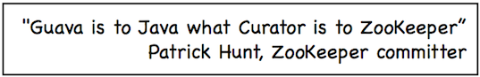

# zk_study

## case1：服务器动态上下线监听案例

某分布式系统中，主节点可以有多台，可以动态上下线，任意一台客户端都能实时感知到主节点服务器上下线

思路：

创建`/servers`节点，服务器上线后，在`/servers`节点下创建临时子节点，客户端监听`/servers`下面子节点的添加和删除

## case2：原生Zookeeper实现分布式锁案例

思路：

1）接收到请求后，在/locks节点下创建一个临时顺序节点

2）判断自己是不是当前节点下最小的节点，是，获取到锁，不是，对前一个节点进行监听

3）获取到锁，处理完业务后，delete节点释放锁，然后下面的节点将收到通知，重复第二步判断

## case3：Curator框架实现分布式锁案例

为什么用Curator框架，而不用原生的`Java API`？

原生的`Java API`开发存在的问题

（1）会话连接是异步的，需要自己去处理

（2）Watch需要重复注册，不然不能生效

（3）开发的复杂性较高

（4）不支持多节点删除和创建，需要自己去递归

`Curator`是一个专门解决分布式锁的框架，解决了原生`Java API`开发分布式遇到的问题

